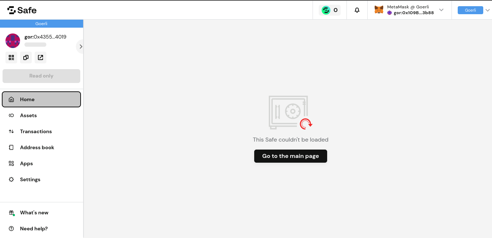

# :moon: Moonkey wallet

**MoonKey** is a smart wallet as a service, powered by an Account Abstraction with ERC4337 standard gnosis safe.
**MoonKey** simplifies the connection between protocols (DEFI,DAO,...) and end-users(collectors,governors,...).

## Custom web interface

Moonkey has it's own implementation of wallet frontend.
Because, Safe web doesn't support ERC-4337 contract addresses.

## Guide

Visit [web source code](https://github.com/moonkey-global/moonkey-next) for frontend.

Visit [contract source code](https://github.com/moonkey-global/moonkey-contracts) for ERC-4337 safe contracts.

